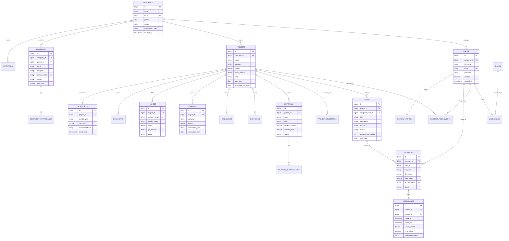

# BuildTrack AI — Smart Construction Workforce & Project Management Platform

BuildTrack AI is an enterprise-grade, multi-tenant operations platform designed for modern civil construction management. It unifies project delivery, workforce attendance, site execution, equipment and materials tracking, financial operations with GST and payment gateway integration, secure document storage, real-time event streaming, and AI-driven predictive risk analytics into a single role-based system.

---

## Table of Contents

- [Core Capabilities & Features](#core-capabilities--features)
- [System Architecture](#system-architecture)
  - [High-Level Design (HLD)](#high-level-design-hld)
  - [Low-Level Design (LLD)](#low-level-design-lld)
  - [Event Streaming Architecture](#event-streaming-architecture)
  - [Payment Processing Flow](#payment-processing-flow)
- [Role-Based Access Control (RBAC)](#role-based-access-control-rbac)
  - [Role Hierarchy](#role-hierarchy)
  - [Personnel Invitation System](#personnel-invitation-system)
  - [Role Feature & Sidebar Matrix](#role-feature--sidebar-matrix)
- [Database Architecture & Data Model](#database-architecture--data-model)
  - [Entity-Relationship Diagram](#entity-relationship-diagram)
  - [Database Table Reference](#database-table-reference)
  - [Database Migrations](#database-migrations)
- [REST API Reference](#rest-api-reference)
- [AI / ML Predictive Engine](#ai--ml-predictive-engine)
- [Technology Stack](#technology-stack)
- [Project Directory Structure](#project-directory-structure)
- [Getting Started & Local Development](#getting-started--local-development)
  - [Prerequisites](#prerequisites)
  - [Environment Configuration](#environment-configuration)
  - [Option 1: Quickstart via Docker Compose](#option-1-quickstart-via-docker-compose)
  - [Option 2: Hybrid / Manual Development Setup](#option-2-hybrid--manual-development-setup)
- [Testing & Verification](#testing--verification)
- [Security & Production Hardening](#security--production-hardening)

---

## Core Capabilities & Features

### 1. Identity, Security & Multi-Tenancy
- **Stateless JWT Authentication**: Access tokens (15 min default) with cryptographically signed refresh tokens (7 days default) stored in PostgreSQL.
- **Tenant Isolation**: Strict organizational scoping ensuring cross-company data leakage is impossible.
- **Zero Public Org Signup**: Public registration creates an approval request for Super Admin; organizational personnel are created strictly via 24-hour single-use cryptographic invitation tokens sent by email.
- **OAuth2 Integration**: Optional Google OAuth login support.

### 2. Project Delivery & Milestone Tracking
- **Lifecycle Management**: Track project stages (`PLANNED`, `IN_PROGRESS`, `DELAYED`, `COMPLETED`).
- **Interactive Gantt Charts & Milestones**: Milestone completion tracking, timeline dependencies, and target dates.
- **Budget Tracking**: Real-time comparison of allocated budget versus actual expenditures.
- **Project Personnel Allocation**: Multi-role assignment linking authorized personnel to designated projects.

### 3. Workforce Management & QR Attendance
- **Digital Workforce Registry**: Comprehensive directory of skilled/unskilled workers with trade classification, daily wages, and unique QR tokens.
- **QR Code Check-In / Check-Out**: Instant verification scanner with duplicate same-day session protection.
- **Automated Wage & Overtime Engine**: Automatic calculation of active hours worked per shift, flagging overtime when shifts exceed 8 hours.
- **Site Verification**: Site Engineers and Company Admins can review, verify, and audit clock-in records with geo-location metadata.

### 4. Task Management & Site Execution
- **Task Lifecycle**: Creation, priority setting (`LOW`, `MEDIUM`, `HIGH`, `CRITICAL`), milestone association, and completion percentage updates.
- **Integrity Validation**: Tasks can only be assigned to users actively allocated to the project within the same company.
- **Sub-contractor Coordination**: Seamless task delegation to Contractor teams.

### 5. Equipment & Heavy Machinery
- **Asset Catalog**: Tracking heavy machinery (Cranes, Excavators, Concrete Mixers, Generators) with serial numbers and operational status (`AVAILABLE`, `IN_USE`, `UNDER_MAINTENANCE`, `DECOMMISSIONED`).
- **Operational Costing**: Daily INR rate tracking per asset for project budget impact analysis.
- **Preventive Maintenance**: Scheduled service logging, maintenance history, and downtime monitoring.

### 6. Materials & Inventory Control
- **Project Inventory**: Catalog of site materials (Cement, Steel, Aggregates, Sand) with unit measurements.
- **Stock Transactions**: Formalized `RECEIPT` and `ISSUE` ledger entries with non-negative stock enforcement.
- **Low Stock Signals**: Real-time alerts generated when quantity falls below configured reorder levels.

### 7. Finance, Invoicing & Razorpay Payments
- **Vendor Invoicing**: Invoicing ledger with automatic 18% GST audit calculations.
- **Expense Categorization**: Breakdown of labor, equipment, material, and operational costs against project budgets.
- **Razorpay Integration**: Server-side order creation (`POST /api/payments/razorpay/order`), modal checkout, and secure webhook verification (`/api/payments/razorpay/webhook`) with HMAC-SHA256 signature validation.
- **Subscription Management**: Automated tenant plan activation upon verified payment receipt.

### 8. Daily Logs, Site Issues & Document Security
- **Daily Site Progress**: Geo-tagged logs documenting site conditions, weather observations, work completed, and worker counts.
- **Issue Tracking & Escalation**: Site defect and hazard reporting with severity tiers and resolution status workflows.
- **Document Management**: Secure upload and categorization of blueprints, CAD drawings, permits, and inspection certificates.

### 9. Real-Time Events & Notifications
- **WebSocket / STOMP Broadcasts**: Real-time event propagation to `/topic/company/{companyId}/...` ensuring multi-tenant isolation.
- **Domain Event Streaming**: High-throughput asynchronous event publishing backed by Apache Kafka.
- **In-App Notification Center**: User-specific alert queues and broadcast alerts.

### 10. AI / ML Predictive Engine
- **Delay Risk Forecasting**: Predictive probability of schedule delay calculated from task velocity and attendance.
- **Cost Overrun Prediction**: Budget burn rate extrapolation against milestone delivery rates.
- **Worker-to-Task Matching**: Skill-to-task compatibility scoring.

---

## System Architecture

### High-Level Design (HLD)

```text
+-----------------------------------------------------------------------------------+
|                                   CLIENT LAYER                                    |
|             React 18 SPA (Vite + Context API + Responsive CSS + STOMP WebSocket) |
+-----------------------------------------┬-----------------------------------------+
                                          │ HTTPS / WSS
                                          ▼
+-----------------------------------------------------------------------------------+
|                            REVERSE PROXY & GATEWAY                                |
|             Nginx Reverse Proxy  ──►  Spring Cloud Gateway (Port 8081)            |
+-----------------------------------------┬-----------------------------------------+
                                          │ Filter Chain & Routing
                                          ▼
+-----------------------------------------------------------------------------------+
|                           SECURITY & AUTHENTICATION                               |
|        Spring Security 6  ──►  JWT Auth Filter  ──►  Tenant Verification          |
+-----------------------------------------┬-----------------------------------------+
                                          │ Authenticated Dispatch
                                          ▼
+-----------------------------------------------------------------------------------+
|                             BACKEND MICRO-SERVICES                                |
|    +--------------------+  +--------------------+  +--------------------+         |
|    | Auth & User Svc    |  | Project & Task Svc |  | Workforce & QR Svc |         |
|    +--------------------+  +--------------------+  +--------------------+         |
|    | Equipment & Mat Svc|  | Finance & Razorpay |  | Daily Logs & Issues|         |
|    +--------------------+  +--------------------+  +--------------------+         |
|    | Notification Svc   |  | Document Svc       |  | AI Insights Svc    |         |
|    +--------------------+  +--------------------+  +--------------------+         |
+-------------------┬─────────────────────┬───────────────────────┬-----------------+
                    │ JPA / Hibernate     │ Event Bus             │ Subprocess
                    ▼                     ▼                       ▼
+-----------------------+ +-----------------------+ +-------------------------------+
|   PERSISTENCE LAYER   | |    MESSAGING LAYER    | |       AI / ML ENGINE          |
|  PostgreSQL 16 DB     | |  Apache Kafka (KRaft) | |  Python 3 Inference Scripts   |
|  (Flyway Migrations)  | |  STOMP WebSockets     | |  (Scikit-Learn / Joblib)      |
+-----------------------+ +-----------------------+ +-------------------------------+
```

### Low-Level Design (LLD)

#### Request Execution Pipeline
```text
React (Client)
  ↓ HTTP Request with Bearer Token
Nginx (Port 80)
  ↓ Proxy Pass
Spring Cloud Gateway (Port 8081)
  ↓ Route to Service
Spring Security Filter Chain
  ↓ JwtAuthenticationFilter validates signature, expiration, and user state
Spring MVC Controller
  ↓ Parses DTO, validates constraints (@Valid)
Business Service Layer
  ↓ Enforces Role-Based Access (RBAC) and Multi-Tenant ownership rules
JPA / Hibernate 6 Repository
  ↓ Executes parameterized query
PostgreSQL 16 Database
```

### Event Streaming Architecture

```text
User Action (Create Task / Clock-in / Stock Issue)
  ↓
Service Layer Persists to PostgreSQL
  ↓ (On Transaction Commit)
Domain Event Published to Kafka Topic: `buildtrack.domain.events`
  ↓
Kafka Domain Event Consumer (Notification & Realtime Service)
  ├── Persists Notification Record in DB
  └── Dispatches STOMP Message to `/topic/company/{companyId}/...`
        ↓
Connected React Dashboards Update Live Without Page Reload
```

### Payment Processing Flow

```text
React Client (Company Admin)
  ↓ Request Order Creation (INR)
Spring Boot Backend (`/api/payments/razorpay/order`)
  ↓ Calls Razorpay Orders API
Razorpay Returns `order_id`
  ↓ Backend creates pending payment record
React opens Razorpay Checkout Modal
  ↓ User completes payment (UPI / Card / NetBanking)
Razorpay Webhook (`/api/payments/razorpay/webhook`)
  ↓ Spring Boot verifies `X-Razorpay-Signature` (HMAC SHA-256)
Payment record updated to `SUCCESS` in PostgreSQL
  ↓ For subscription payments: company plan activated
Kafka Event published → WebSocket notification delivered to UI
```

---

## Role-Based Access Control (RBAC)

### Role Hierarchy

```text
SUPER_ADMIN
  │ (Approves companies, manages platform, global oversight)
  ▼
COMPANY_ADMIN
  │ (Creates projects, manages finance, registers equipment/materials)
  │ (Issues 24-hr email invitations to company personnel)
  ├──► PROJECT_MANAGER  (Manages assigned projects, timelines, tasks, logs)
  ├──► SITE_ENGINEER    (Logs daily site activity, verifies QR attendance, issues materials)
  ├──► CONTRACTOR       (Oversees sub-contractor tasks, equipment & attendance)
  └──► WORKER           (Performs tasks, clocks in/out via QR, views wages)
```

### Personnel Invitation System

Organizational staff cannot sign up through public registration. They must be invited by their `COMPANY_ADMIN`:

- **Endpoint**: `POST /api/company/personnel/invitations`
- **Allowed Roles for Invitation**: `PROJECT_MANAGER`, `SITE_ENGINEER`, `CONTRACTOR`, `WORKER`
- **Workflow**:
  1. Company Admin submits personnel email, full name, and target role.
  2. Backend validates company subscription, checks for duplicate accounts, generates a cryptographically secure random token, and sets a 24-hour expiry.
  3. System sends an email containing the unique invitation URL: `/accept-invitation?token={token}`.
  4. The invitee opens the link, sets their secure password, and their active account is provisioned under the inviting company's tenant.

### Role Feature & Sidebar Matrix

| Module / Feature | Super Admin | Company Admin | Project Manager | Site Engineer | Contractor | Worker |
|---|:---:|:---:|:---:|:---:|:---:|:---:|
| **Platform & Company Approval** | Full | — | — | — | — | — |
| **Project Creation & Budgeting** | View All | Full | — | — | — | — |
| **Project Timeline & Gantt** | View All | Full | Full (Assigned) | View (Assigned) | View (Assigned) | — |
| **Personnel Invitations** | — | Full | — | — | — | — |
| **Workforce Directory** | View All | Full | Assigned Proj | Assigned Proj | Assigned Proj | — |
| **QR Attendance Check-In** | — | — | — | QR Scanner | Sub-team | Self QR |
| **Attendance Verification** | View All | Full | Assigned Proj | Assigned Proj | Assigned Proj | — |
| **Task Creation & Assignment** | View All | Full | Assigned Proj | Assigned Proj | Sub-team | — |
| **Task Progress Update** | — | Full | Full | Full | Full | Assigned Only |
| **Equipment Management** | View All | Full | View (Assigned) | Maintenance Log | Assigned | Assigned |
| **Materials & Stock Ledger** | View All | Full | View (Assigned) | Receive & Issue | Issue Only | Issue Only |
| **Finance, Invoices & GST** | View All | Full | View (Assigned) | — | Sub-Invoices | — |
| **Razorpay Subscriptions** | — | Full | — | — | — | — |
| **Daily Site Logs** | View All | Full | Full (Assigned) | Create & Log | View (Assigned) | — |
| **Site Issues & Hazards** | View All | Full | Full (Assigned) | Create & Resolve| Create & Track | View |
| **Document Storage** | View All | Full | Full (Assigned) | Full (Assigned) | View (Assigned) | View (Assigned) |
| **AI Predictive Insights** | Full | Full | Assigned Proj | — | — | — |

---

## Database Architecture & Data Model

### Entity-Relationship Diagram



### Database Table Reference

| Module | Primary Tables | Supporting / Join Tables |
|---|---|---|
| **Identity & Access** | `users`, `roles`, `permissions` | `user_roles`, `role_permissions`, `refresh_tokens`, `email_verification_tokens`, `password_reset_tokens`, `user_invitations` |
| **Tenancy & Projects** | `companies`, `projects` | `project_assignments`, `project_milestones` |
| **Workforce & QR** | `workers`, `attendance` | `shifts`, `worker_performance` |
| **Task Execution** | `tasks` | `task_dependencies`, `task_comments` |
| **Equipment & Assets** | `equipment` | `equipment_maintenance`, `equipment_assignments` |
| **Materials & Inventory** | `materials` | `material_transactions` |
| **Finance & Invoicing** | `finances`, `invoices`, `payments` | `subscription_plans` |
| **Site Logs & Issues** | `daily_logs`, `site_issues` | `site_images`, `site_issue_comments` |
| **Documents & Media** | `documents` | `site_images` |
| **Realtime & Alerts** | `notifications` | `notification_recipients` |
| **AI Predictive Engine** | `ai_insights` | `ai_model_metrics` |

### Database Migrations

Database schema versioning is managed via Flyway in `backend/src/main/resources/db/migration` and mirrored in `database/migrations`:

1. `001_create_users_table.sql` — Identity, roles, permissions, tokens.
2. `002_create_projects_table.sql` — Companies, projects, milestones.
3. `003_create_workers_table.sql` — Workforce registry and QR tokens.
4. `004_create_attendance_table.sql` — Shift records and timestamps.
5. `005_create_tasks_table.sql` — Task scheduling and completion.
6. `006_create_equipment_table.sql` — Machinery catalog and maintenance.
7. `007_create_finance_table.sql` — Finances, invoices, and payments.
8. `008_create_documents_table.sql` — Document management and site images.
9. `009_create_notifications_table.sql` — Notification engine schema.
10. `010_add_attendance_verification.sql` — Attendance verification status.
11. `011_create_invitation_and_payment_support.sql` — Invitations & Razorpay columns.
12. `012_create_project_assignments.sql` — Personnel project allocation.
13. `013_step3_workforce_tasks.sql` — Workforce & task relation constraints.
14. `014_step4_attendance.sql` — Worker account linkage (`workers.user_id`).
15. `015_step5_equipment_materials.sql` — Material inventory & stock ledgers.
16. `016_step6_finance_razorpay.sql` — Payment transaction audit logging.
17. `017_step7_daily_logs.sql` — Site daily progress log tables.
18. `018_step7_document_security.sql` — Document access control rules.
19. `019_step8_notifications_events.sql` — Domain event indexing.
20. `020_final_schema_alignment.sql` — Final foreign keys and constraint hardening.
21. `021_step10_site_issues.sql` — Site defects and safety issue tracking.

---

## REST API Reference

### Authentication & Invitations
| Method | Endpoint | Description | Access |
|---|---|---|---|
| `POST` | `/api/auth/login` | Authenticate credentials and receive JWT + Refresh token | Public |
| `POST` | `/api/auth/refresh` | Exchange valid refresh token for a new JWT | Public |
| `POST` | `/api/auth/logout` | Invalidate active refresh token | Authenticated |
| `POST` | `/api/public/company-registration` | Submit company registration request | Public |
| `POST` | `/api/company/personnel/invitations` | Issue 24-hr email invitation to personnel | `COMPANY_ADMIN` |
| `POST` | `/api/auth/accept-invitation` | Accept invitation token and set account password | Public |
| `POST` | `/api/auth/forgot-password` | Request password reset token via email | Public |
| `POST` | `/api/auth/reset-password` | Reset password using verified token | Public |

### Projects & Assignments
| Method | Endpoint | Description | Access |
|---|---|---|---|
| `GET` | `/api/projects` | List projects (scoped to tenant or assignment) | Authenticated |
| `GET` | `/api/projects/{id}` | Get project details, milestones, and budget summary | Tenant / Assigned |
| `POST` | `/api/projects` | Create a new project | `SUPER_ADMIN`, `COMPANY_ADMIN` |
| `PUT` | `/api/projects/{id}` | Update project metadata, status, or budget | `SUPER_ADMIN`, `COMPANY_ADMIN` |
| `DELETE` | `/api/projects/{id}` | Delete a project | `SUPER_ADMIN`, `COMPANY_ADMIN` |
| `GET` | `/api/projects/{id}/assignments` | List personnel assigned to project | Tenant / Assigned |
| `POST` | `/api/projects/{id}/assignments` | Assign personnel to project | `COMPANY_ADMIN` |
| `DELETE` | `/api/projects/{id}/assignments/{userId}` | Remove personnel from project | `COMPANY_ADMIN` |
| `GET` | `/api/projects/eligible-users` | Filter company personnel eligible for assignment | `COMPANY_ADMIN` |

### Workforce & Attendance
| Method | Endpoint | Description | Access |
|---|---|---|---|
| `GET` | `/api/workforce` | List workforce directory | Tenant / Assigned |
| `POST` | `/api/workforce` | Register worker profile and generate QR token | `COMPANY_ADMIN` |
| `GET` | `/api/attendance` | Query attendance logs (filterable by date/project) | Tenant / Assigned |
| `POST` | `/api/attendance/check-in` | Clock in worker with QR token and location | `SITE_ENGINEER`, `WORKER` |
| `POST` | `/api/attendance/check-out` | Clock out worker and calculate shift hours | `SITE_ENGINEER`, `WORKER` |
| `PUT` | `/api/attendance/{id}/verify` | Verify attendance record | `COMPANY_ADMIN`, `SITE_ENGINEER` |

### Tasks & Site Execution
| Method | Endpoint | Description | Access |
|---|---|---|---|
| `GET` | `/api/tasks` | List tasks (filterable by project / status) | Tenant / Assigned |
| `POST` | `/api/tasks` | Create task linked to project milestone | `COMPANY_ADMIN`, `PROJECT_MANAGER` |
| `PUT` | `/api/tasks/{id}` | Update task details or priority | `COMPANY_ADMIN`, `PROJECT_MANAGER` |
| `PATCH` | `/api/tasks/{id}/progress` | Update completion percentage and status | Assignee, PM, Engineer |
| `DELETE` | `/api/tasks/{id}` | Remove task | `COMPANY_ADMIN`, `PROJECT_MANAGER` |

### Equipment & Materials
| Method | Endpoint | Description | Access |
|---|---|---|---|
| `GET` | `/api/equipment` | List heavy machinery and operational status | Tenant / Assigned |
| `POST` | `/api/equipment` | Register equipment asset | `COMPANY_ADMIN` |
| `POST` | `/api/equipment/{id}/maintenance` | Log preventive or corrective service record | `COMPANY_ADMIN`, `SITE_ENGINEER` |
| `GET` | `/api/materials` | List project materials and current inventory | Tenant / Assigned |
| `POST` | `/api/materials` | Create material inventory item | `COMPANY_ADMIN`, `SITE_ENGINEER` |
| `POST` | `/api/materials/transactions` | Log stock transaction (`RECEIPT` / `ISSUE`) | Admin, Engineer, Contractor |

### Finance, Invoices & Razorpay
| Method | Endpoint | Description | Access |
|---|---|---|---|
| `GET` | `/api/finances` | Get project financial breakdown and budget status | `SUPER_ADMIN`, `COMPANY_ADMIN` |
| `GET` | `/api/invoices` | List vendor invoices with 18% GST audit | `SUPER_ADMIN`, `COMPANY_ADMIN` |
| `POST` | `/api/invoices` | Create vendor invoice | `COMPANY_ADMIN`, `CONTRACTOR` |
| `POST` | `/api/payments/razorpay/order` | Create Razorpay payment order (INR paise) | `COMPANY_ADMIN` |
| `POST` | `/api/payments/razorpay/webhook` | Webhook receiver for Razorpay signature verification | Razorpay Server |

### Daily Logs, Site Issues & Documents
| Method | Endpoint | Description | Access |
|---|---|---|---|
| `GET` | `/api/daily-logs` | List daily site activity logs | Tenant / Assigned |
| `POST` | `/api/daily-logs` | Submit daily progress log with geo-tags | `COMPANY_ADMIN`, `SITE_ENGINEER` |
| `GET` | `/api/site-issues` | List reported hazards and defects | Tenant / Assigned |
| `POST` | `/api/site-issues` | Report new site issue with severity level | Engineer, Contractor, PM |
| `PATCH` | `/api/site-issues/{id}/status` | Update issue resolution status | PM, Engineer |
| `GET` | `/api/documents` | List project documents, CAD files, and permits | Tenant / Assigned |
| `POST` | `/api/documents/upload` | Upload document attachment (multipart file) | Admin, PM, Engineer |

### AI Predictive Insights
| Method | Endpoint | Description | Access |
|---|---|---|---|
| `GET` | `/api/ai-insights/project/{projectId}` | Fetch AI delay risk and cost overrun predictions | `SUPER_ADMIN`, `COMPANY_ADMIN`, `PROJECT_MANAGER` |
| `POST` | `/api/ai-insights/generate` | Trigger on-demand ML predictive inference run | `SUPER_ADMIN`, `COMPANY_ADMIN` |

---

## AI / ML Predictive Engine

The `ai-ml/` module contains standalone Python 3 inference models that deliver predictive intelligence to project managers:

- **Delay Risk Model (`predict_delay.py`)**: Analyzes planned duration, current progress percentage, active workforce count, and historical weather/log delays to predict schedule delay probability (0.0 to 1.0) and risk tier (`LOW`, `MEDIUM`, `HIGH`, `CRITICAL`).
- **Cost Overrun Model (`predict_cost_overrun.py`)**: Evaluates budget vs. actual spend, milestone completion velocity, and equipment daily burn rate to forecast cost overrun percentage.
- **Worker Matching Model (`predict_worker_match.py`)**: Recommends optimal worker allocation based on skill trade, performance scores, and task requirements.

```bash
# Execute standalone AI inference test
cd ai-ml
python inference/predict_delay.py --project_id 1 --progress 45 --duration 120 --workers 18
```

---

## Technology Stack

| Layer | Component | Version / Library |
|---|---|---|
| **Frontend** | Framework & Build Tool | React 18.3, Vite 5.4, React Router v6 |
| | Icons & Visualization | Lucide React, Custom CSS Design Tokens (Dark & Light modes) |
| | HTTP & WebSocket Client | Axios, Native STOMP over WebSockets |
| **Backend** | Language & Framework | Java 21, Spring Boot 3.3.2 |
| | Security & Auth | Spring Security 6, JJWT 0.12.6, BCrypt, OAuth2 Client |
| | Persistence & ORM | Spring Data JPA, Hibernate 6, Flyway Migration Engine |
| | Realtime & Messaging | Spring WebSocket / STOMP, Spring Kafka |
| | Utilities & Mapping | Lombok 1.18, ModelMapper 3.2, Spring Mail |
| **Persistence** | Relational Database | PostgreSQL 16 (Relational tables, indexed foreign keys) |
| **Event Broker** | Message Broker | Apache Kafka (KRaft mode, zero-ZooKeeper) |
| **Gateway & Proxy**| API Routing & Proxy | Spring Cloud Gateway, Nginx |
| **Payments** | Payment Processing | Razorpay Orders API, Webhook Signature Verification |
| **AI / Machine Learning** | Inference Scripts | Python 3, Scikit-Learn, Pandas, NumPy, Joblib |
| **DevOps** | Containerization | Docker, Docker Compose |

---

## Project Directory Structure

```text
BuildTrack-AI/
├── README.md                      # Comprehensive Master Documentation
├── docker-compose.yml             # Container orchestration (PostgreSQL, Kafka, Gateway, Backend, Frontend)
├── .env.example                   # Environment variable template
├── .gitignore                     # Git ignore rules
│
├── backend/                       # Spring Boot 3 REST API & WebSocket Backend
│   ├── pom.xml                    # Maven build & dependency definitions
│   ├── Dockerfile                 # Backend container definition
│   └── src/
│       ├── main/
│       │   ├── java/com/buildtrack/ai/
│       │   │   ├── auth/          # Authentication, JWT filters, OAuth2 handlers
│       │   │   ├── config/        # Security, CORS, WebSocket, Kafka, Flyway config
│       │   │   ├── controller/    # REST API controllers for all modules
│       │   │   ├── dto/           # Request/Response Data Transfer Objects
│       │   │   ├── entity/        # JPA relational entities
│       │   │   ├── event/         # Kafka domain event models & publishers
│       │   │   ├── exception/     # Global exception handlers (@RestControllerAdvice)
│       │   │   ├── repository/    # Spring Data JPA repositories
│       │   │   ├── security/      # UserDetails, Token providers, Tenant context
│       │   │   └── service/       # Business logic implementations
│       │   └── resources/
│       │       ├── application.properties # Spring configuration & environment placeholders
│       │       └── db/migration/  # Flyway versioned SQL migrations (001 to 021)
│       └── test/                  # Automated JUnit & Spring Boot integration tests
│
├── frontend/                      # React 18 SPA Frontend
│   ├── package.json               # NPM script definitions and dependencies
│   ├── vite.config.js             # Vite development & build configuration
│   ├── Dockerfile                 # Multi-stage frontend build container
│   ├── nginx.conf                 # Production Nginx configuration for SPA routing
│   └── src/
│       ├── context/               # AuthContext, ThemeContext, DataContext
│       ├── layouts/               # Role-specific layouts (SuperAdmin, CompanyAdmin, PM, Engineer, Contractor, Worker)
│       ├── components/            # Reusable UI components (Sidebar, Topbar, Modals, Gantt, Stats)
│       ├── pages/                 # Role-based dashboard pages & public views
│       ├── styles/                # CSS variables, light/dark theme tokens, dashboard styles
│       └── services/              # Axios API clients & WebSocket STOMP subscribers
│
├── gateway/                       # Spring Cloud Gateway
│   ├── pom.xml                    # Gateway dependencies
│   ├── Dockerfile                 # Gateway container configuration
│   └── src/main/resources/application.yml # API route and upstream definitions
│
├── nginx/                         # Top-level reverse proxy configuration
│   └── nginx.conf                 # Public entry point proxy routing to Gateway & Frontend
│
├── database/                      # Standalone database scripts & reference schemas
│   ├── migrations/                # Versioned SQL migration scripts (001_ to 021_)
│   ├── schema.sql                 # Consolidated database DDL
│   └── seed.sql                   # Sample seed dataset
│
└── ai-ml/                         # Python AI / ML Predictive Engine
    ├── requirements.txt           # Python dependencies
    ├── model_config.json          # Model hyperparameters and risk threshold config
    ├── inference/                 # Delay, cost overrun, and worker matching predictors
    ├── training/                  # Model training pipelines
    ├── datasets/                  # Historical training datasets
    └── models/                    # Serialized joblib model binaries
```

---

## Getting Started & Local Development

### Prerequisites

- **Java Development Kit (JDK)**: Java 21 or higher
- **Node.js**: Node 18.x or 20.x with `npm`
- **Docker & Docker Compose**: Docker 24.x+
- **Apache Maven**: Maven 3.9+ (if running backend outside Docker)
- **Python**: Python 3.10+ (for AI/ML inference utilities)

---

### Environment Configuration

Create a `.env` file in the project root by copying the template:

```powershell
Copy-Item .env.example .env
```

Configure the environment variables in `.env`:

```ini
# Security & JWT
JWT_SECRET=your_super_secret_base64_encoded_key_at_least_256_bits_long
SUPER_ADMIN_EMAIL=admin@buildtrack.ai
SUPER_ADMIN_PASSWORD=YourSecureSuperAdminPassword123!

# Razorpay Credentials (Optional for local testing)
RAZORPAY_KEY_ID=rzp_test_your_key_id
RAZORPAY_KEY_SECRET=your_key_secret
RAZORPAY_WEBHOOK_SECRET=your_webhook_secret

# Spring Mail / SMTP (For email invitations)
MAIL_USERNAME=notifications@yourdomain.com
MAIL_PASSWORD=your_app_password
MAIL_HOST=smtp.gmail.com
MAIL_PORT=587

# OAuth2 (Optional)
GOOGLE_CLIENT_ID=your_google_oauth_client_id
GOOGLE_CLIENT_SECRET=your_google_oauth_client_secret
```

---

### Option 1: Quickstart via Docker Compose

Run the entire platform (PostgreSQL, Kafka, Backend, Gateway, Frontend) with a single command:

```powershell
docker compose up -d --build
```

#### Service URLs
- **Frontend Dashboard**: `http://localhost` (Port 80)
- **API Gateway**: `http://localhost:8081`
- **Backend API Direct**: `http://localhost:8080`
- **PostgreSQL Database**: `localhost:5433` (DB: `buildtrack_ai`, User: `buildtrack`, Pass: `buildtrack_password`)
- **Apache Kafka**: `localhost:29092`

---

### Option 2: Hybrid / Manual Development Setup

For active day-to-day feature development, you can run PostgreSQL and Kafka in Docker while running the frontend and backend locally with hot-reloading:

#### 1. Start Database & Kafka
```powershell
docker compose up -d database kafka
```

#### 2. Run Backend
```powershell
cd backend
mvn spring-boot:run
```
*Flyway will automatically execute all SQL migrations (001 through 021) and baseline the schema.*

#### 3. Run Gateway (Optional)
```powershell
cd gateway
mvn spring-boot:run
```

#### 4. Run Frontend
```powershell
cd frontend
npm install
npm run dev
```
*The frontend development server will start at `http://localhost:5173`.*

---

## Testing & Verification

### Backend Automated Test Suite
Execute the JUnit test suite and validation tests:

```powershell
cd backend
mvn test
```

To compile without running tests:
```powershell
mvn clean package -DskipTests
```

### Frontend Build Validation
Verify that the React production bundle compiles cleanly:

```powershell
cd frontend
npm run build
```

### Health & Monitoring Endpoints
- Backend Liveness Probe: `http://localhost:8080/actuator/health/liveness`
- Backend Readiness Probe: `http://localhost:8080/actuator/health/readiness`
- Gateway Health Probe: `http://localhost:8081/actuator/health`

---

## Security & Production Hardening

1. **Secret Isolation**: Never commit actual API keys, JWT secrets, or SMTP credentials. Always inject via environment variables or secret managers.
2. **Password Hashing**: User passwords are encrypted with BCrypt (cost factor 10).
3. **Database Schema Drift Prevention**: In production, Hibernate `ddl-auto` is set to `validate` so unauthorized entity changes fail fast without modifying live tables.
4. **Tenant Security**: All data access queries enforce tenant identity extracted from the authenticated JWT security context. Cross-company access is blocked at the service layer.
5. **Razorpay HMAC Signature Verification**: All webhook updates verify `X-Razorpay-Signature` to prevent spoofing.
6. **CORS Isolation**: CORS is locked down to authorized frontend origins.

