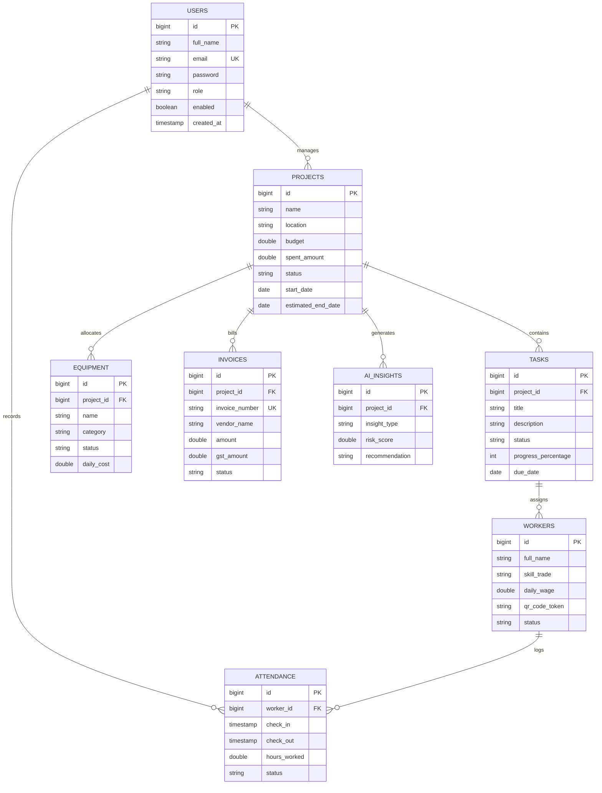

# BuildTrack AI - Entity-Relationship Diagram (ERD) Specification

## 1. Schema Diagram (Mermaid)

## 2. Table Summary
- **users**: Authentication credentials, roles (`ADMIN`, `MANAGER`, `ENGINEER`, `WORKER`).
- **projects**: Construction site master data, financial budget caps, status tracking.
- **tasks**: Individual work packages associated with Gantt chart milestones.
- **workers**: Skilled/Unskilled workforce directory with unique QR code payload tokens.
- **attendance**: Clock-in and clock-out timestamps for salary calculation.
- **equipment**: Heavy machinery inventory and maintenance status.
- **invoices**: Vendor billings, payments, and 18% GST audit records.
- **ai_insights**: Machine learning output predictions for delay risk, cost overrun, and worker productivity.
